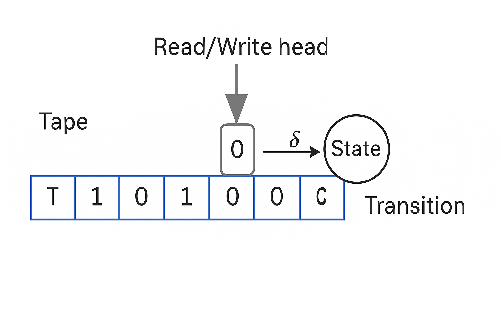
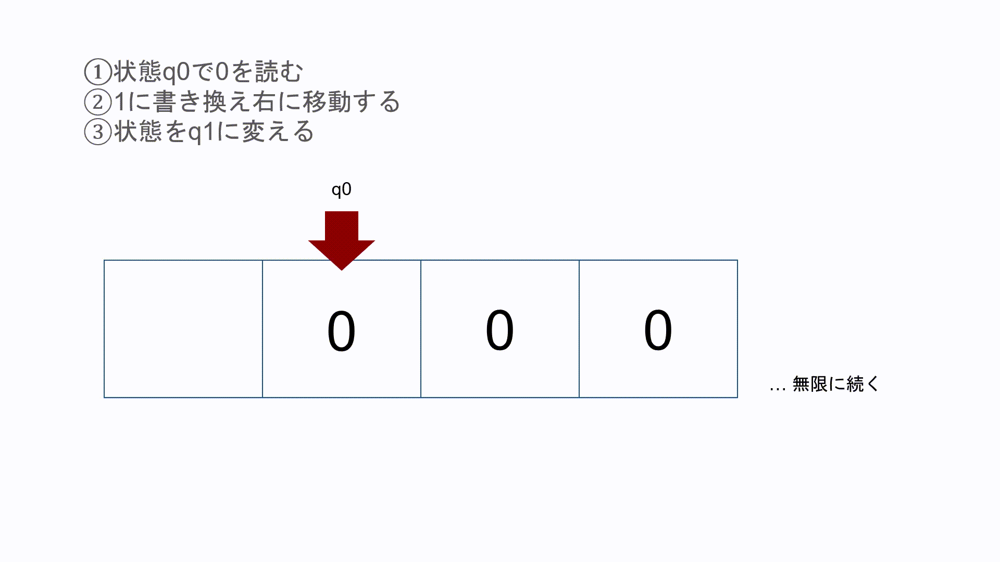
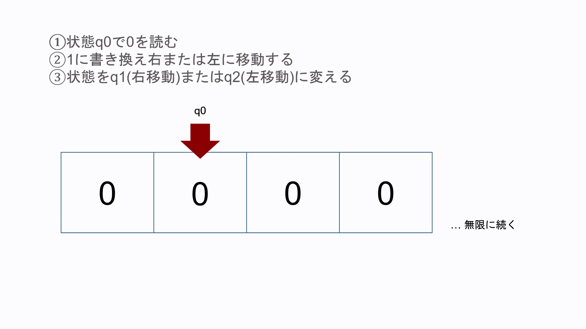
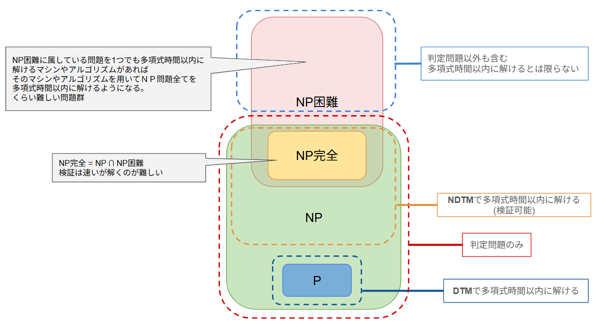

## 計算可能性理論
* 何が計算できるのか？

### チューリングとは
> アラン・チューリング（Alan Turing, 1912–1954） は、イギリスの数学者・論理学者で、「計算可能性理論」や「人工知能（AI）」の創始者とされる人物
> 1936 年に「チューリングマシン」という概念を提案し、計算できるとは何か？ を形式的に定義した。このチューリングマシンのモデルは、現代のコンピュータの理論的基盤になっている。

### チューリングマシン(TM)とは
* 以下のような構成を持つ理論上の計算機

|要素|説明|
|--|--|
|無限のテープ|無限に続く記憶装置。各セルには記号(0,1,空白)を書き込める.(excelのイメージ？)|
|ヘッド(読み書き装置)|現在位置のセルの記号を読み書きし、左右に移動できる。|
|状態|マシンは内部状態（q0, q1, ..., qAccept, qRejectなど）を持ち、状態遷移によって動作する。|
|遷移関数 δ(デルタ)|現在の状態と読み取った記号に応じて、次の状態・書き込み・移動方向（L/R）を決定する。|



### 決定性チューリングマシン(DTM)
* 特徴
  * 各状態において、入力記号に対する次の動作がただ一つに定まっている。
  * 入力に対して1本の処理経路のみをたどる。
  * 現実のコンピュータのモデルに近く、1つの手続きに従って処理を順番に進めるため、動作が予測可能
* 例
```text
状態 q0 で「0」を読んだら、「1」に書き換えて、右に移動し、状態を q1 に変える

・ 状態q0: q1という現在のチューリングマシンの動作モード
・ テープ上の0を読んで、1に上書きする
・ 読み書きヘッドを右のセルに動かす
・ 内部状態をq1に更新し次の動作モードに遷移
```
以下で表す
```
δ(q0, 0) = (q1, 1, R)
```

* 具体的な例
 > 迷路でゴールを目指す。
 行き止まりになったらひとつ前の分岐点に戻って、別の道を選ぶ。 



### 非決定性チューリングマシン(NDTM)
* 特徴
  * 各状態・記号の組み合わせに対して、複数の選択肢（遷移先）が存在する。
  * マシンは、すべての選択肢を「同時に」探索して、どれか1つでも受理状態に到達すれば「受理」とする。
* イメージ
  * マシンが無限の分身を持って、並列で探索しているような動作。
* 例
```
状態q0で0読んだら「1に書き換えて、右に移動し、状態を q1 に変える」動作または「0に書き換えて、左に移動し、状態を q2 に変える」動作を行う
δ(q0, 0) = {(q1, 1, R), (q2, 0, L)}
```
* メリットと論理的意味
  * 非決定性チューリングマシンは、NP問題（非決定性多項式時間の定義に重要。
    * 巡回セールスマン問題（TSP）
    * グラフ彩色問題
    * ナップサック問題　など
  * 「ある解が存在するか？」を並列的に探索できる理想モデル

* もう少しかみ砕く
  * 非決定性とは
  >  **ある状態で複数の選択肢があり、どれを選ぶかが“決まっていない”状態**
  [決まっていない]とは次の動作が複数ある。最終的にどれが選ばれるか未定である。

  * 右または左に移動する
  > **右or左と言う意味ではない**
  同時に(並列的に)右に行くパターンと左に行くパターンを試すという意味
  q1,q2はそれぞれ同時に左右に移動する
  * q1,q2が右右、左左には移動しないのか？
  > **可能性として同時にすべての経路をたどる**という概念
  ゆえに必ず左右に移動するという考え方をする



* 具体的な例
 > 迷路でゴールを目指す。
 分岐点で自身が分身してそれぞれの道を行く。
 それぞれの道でさらに分岐点にきたら、さらに分身してそれぞれの道を行く

:::note info
非決定性チューリングマシン(NDTM)はどんどん計算量が増える
:::

### 問題難易度(p/NP/BP完全/NP困難)
#### P 
* 概要
  * DTMで多項式時間以内に解ける
  * 判定問題のみ
#### NP
* 概要
  * NDTMで多項式時間以内に解ける
  * 判定問題のみ
  * Pも含む
  * NP完全でもPでもないものはNP中間問題と呼ばれる

#### NP完全
* 概要
  * NDTMで多項式時間以内に解ける
  * NP問題の中で最も難しい問題の集合
  * 難しさ→NP完全の問題が解けたら、NPの問題もその問題に多項式時間で変換できるくらい難しい
  * NPかつNP困難の問題の集合
  * 判定問題のみ
* 代表的な問題
  * 充填問題（ナップサック問題）
  * 巡回セールスマン問題（判定版）
  * 3-SAT（充足可能性問題）
  * グラフ彩色問題（3色彩色）

#### NP困難
* 概要
  * NDTMで多項式時間以内に解けるとは限らない
    * NPに属しているものは解けるが、属していない物に関しては必ずしも解けないし、絶対に解けない問題(停止性問題)も存在する
  * 難しさ→NP完全の問題が解けたら、NPの問題もその問題に多項式時間で変換できるくらい難しい
  * 判定問題に限らない
* 代表的な問題
  * 停止性問題
  * TSP
#### まとめ
|計算量クラス|判定問題のみか|DTMで多項式時間で解けるか|NDTMで多項式時間で解けるか|
|--|--|--|--|
|P|○|○|○|
|NP|○|未解決(わかってない)|○|
|NP完全|○|未解決|○|
|NP困難|含まないこともある|今の技術・理論では効率よく多項式時間で解く方法がすべてのケースに対して見つかっていない|解けるとは限らない(停止性問題は解けない)|




## 計算量理論
* どれくらい効率的に計算できるか
## 形式言語理論
* 文法・オートマトン
