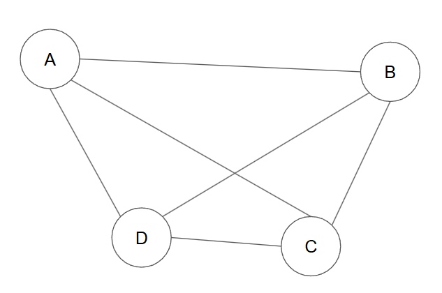

## 数え上げ
### 前提
* 全ての場所に必ず1回寄る
* 全て回ったらスタート地点に戻る

### 公式
* スタート地点がどこでも良い場合
```
(N-1)!
```
* スタート地点固定
```
(N-1)!/2
```


### 考え方
#### 総数



|Aから始まるパターン|Bから始まるパターン|Cから始まるパターン|Dから始まるパターン|
|--|--|--|--|
|<font color="red">1. A→B→C→D</font></font><br><font color="blue">2. A→B→D→C</font><br><font color="orange">3. A→C→B→D</font><br><font color="blue">4. A→C→D→B</font><br><font color="orange">5. A→D→B→C</font><br><font color="red">6. A→D→C→B</font>|<font color="blue">1. B→A→C→D</font><br><font color="red">2. B→A→D→C</font><br><font color="orange">3. B→C→A→D</font><br><font color="red">4. B→C→D→A</font><br><font color="orange">5. B→D→A→C</font><br><font color="blue">6. B→D→C→A</font><br>|<font color="blue">1. C→A→B→D</font><br><font color="orange">2. C→A→D→B</font><br><font color="red">3. C→B→A→D</font><br><font color="orange">4. C→B→D→A</font><br><font color="red">5.C→D→A→B</font><br><font color="blue">6. C→D→B→A</font><br>|<font color="red">1. D→A→B→C</font><br><font color="orange">2. D→A→C→B</font><br><font color="blue">3. D→B→A→C</font><br><font color="orange">4. D→B→C→A</font><br><font color="blue">5. D→C→A→B</font><br><font color="red">6. D→C→B→A</font><br>|

(4箇所しか書いてないが、最後はスタート地点に戻る)

 
|出発点|経路|総数|説明|
|--|--|--|--|
|固定|区別する|$$(n-1)!$$|Aから出発する経路を選択する。経路は区別するので全6経路<br>円順列と同じ|
|固定|区別しない|$$\frac{(n-1)!}{2}$$|Aから出発する経路を選択する。経路は区別しないので、右回り左回りを1経路と考える。全3経路。同一色の経路が同じなため1経路と考える。|
|自由|区別する|$$n!$$または$$(n-!)\times{n}$$|A~Dの全ての出発点が対象になる。経路は区別するので、考えうる全ての経路、全24経路。線形の数え方と同じ$$出発地固定の円順列×出発地点になりうる地点の数$$|
|自由|区別しない|$$\frac{n!}{2}$$|A~Dの全ての出発点が対象になる。経路は区別しないので、右回り左回りを1経路と考える全12経路。各出発地点から同一色を1経路として考えた経路の数または、出発地固定で経路区別しないパターン×出発地点になりうる地点の数|

> **💡経路を区別するとは**
A→B→C→D,A→D→C→Bは、同じであると考える
スタート地点や回る順番が違うが、これは**どの経路が一番効率よく回れるか**を考える問題なので、同じ道を通るのなら同じと考える
```text
 A → B    A ← B
 ↑   ↓    ↓   ↑
 D ← C    D → C
```


* TSPは`出発点は固定、向きは区別しない`で解いていく


### 戦略
* 貪欲法
* 焼きなまし
* 2-opt法
